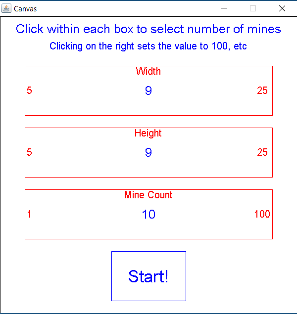
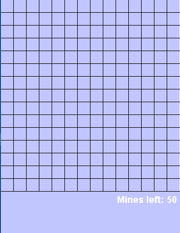
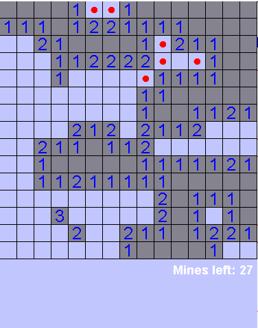
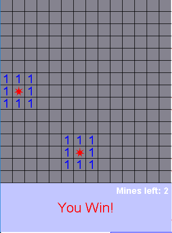
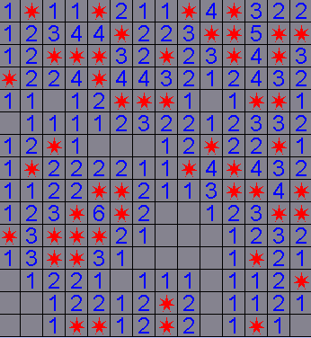

# Minesweeper
A class project: minesweeper, fully functional, lots of fun

# Gameplay

The game starts with an absolutely beautiful parameter selection screen: 

 > Not an artist. 
Here you can select the width and height of the game and the number of mines. Then, the game starts: 

 > beautiful. 
Gameplay begins as expected: click squares, flag mines.

 > The circles are flags 
Then you either win: 

Or lose. 

And that's about it. Minesweeper. It's fun. 
